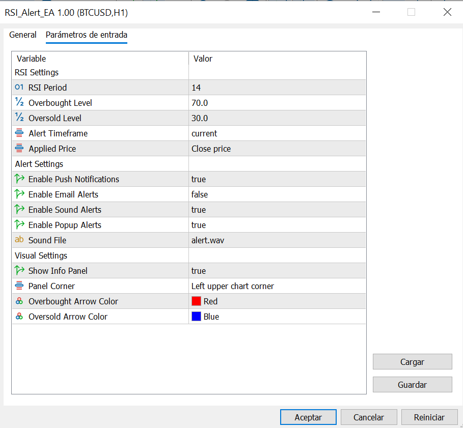
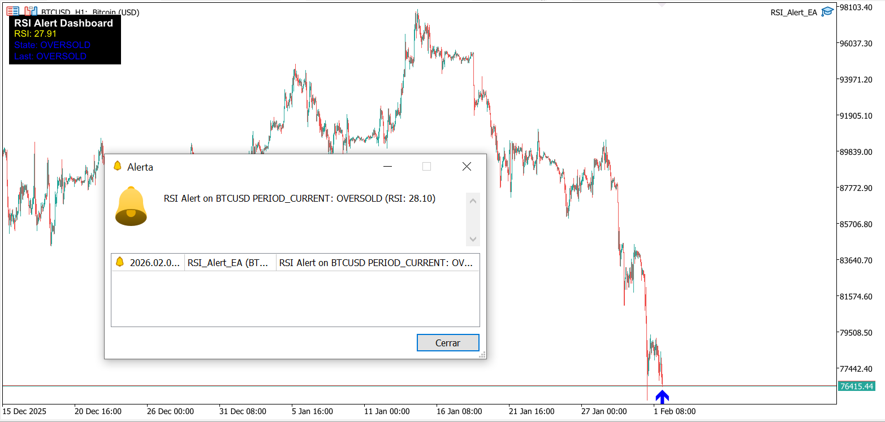

# RSI Alert EA

A comprehensive RSI-based alert system for MetaTrader 5 that provides multi-channel notifications when the RSI indicator crosses user-defined overbought or oversold levels.

## Features

- **Multi-Channel Alerts:** Push notifications, email alerts, sound alarms, and popup messages
- **Visual Feedback:** Automatically draws arrows on the chart when alert conditions are triggered
- **Real-Time Dashboard:** On-chart information panel displaying current RSI value, market state, and last signal
- **Fully Customizable:** Configure RSI period, overbought/oversold levels, and timeframe
- **Non-Intrusive:** Alert system designed to avoid spam with smart triggering logic
- **Clean Code:** Well-structured and commented for easy customization

## Input Parameters

| Parameter | Type | Default | Description |
|-----------|------|---------|-------------|
| RSI_Period | int | 14 | Period for RSI calculation |
| Overbought_Level | double | 70.0 | Upper threshold for overbought alerts |
| Oversold_Level | double | 30.0 | Lower threshold for oversold alerts |
| Alert_Timeframe | ENUM_TIMEFRAMES | PERIOD_CURRENT | Timeframe for RSI calculation |
| Enable_Push_Notifications | bool | true | Send push notifications to mobile |
| Enable_Email_Alerts | bool | false | Send email alerts |
| Enable_Sound_Alerts | bool | true | Play sound when alert triggers |
| Enable_Popup_Alerts | bool | true | Show popup message box |
| Sound_File | string | "alert.wav" | Sound file name in Sounds folder |
| Show_Info_Panel | bool | true | Display on-chart info dashboard |
| Panel_Corner | ENUM_BASE_CORNER | CORNER_RIGHT_UPPER | Corner position for info panel |

## Installation

1. Copy `RSI_Alert_EA.mq5` to your MetaTrader 5 `MQL5/Experts/` directory
2. Open MetaEditor (F4 in MT5)
3. Open the file and compile it (F7)
4. Restart MT5 or refresh the Navigator panel (Ctrl+N)
5. Find "RSI_Alert_EA" under Expert Advisors in the Navigator
6. Drag it onto your desired chart

## Usage

1. **Attach to Chart:** Drag the EA from Navigator onto any currency pair chart
2. **Configure Parameters:** Adjust RSI period and alert levels based on your strategy
3. **Enable Auto-Trading:** Click the "AutoTrading" button in MT5 toolbar (this EA doesn't trade, but needs it active for alerts)
4. **Monitor:** The info panel will show real-time RSI values and market state
5. **Receive Alerts:** When RSI crosses thresholds, you'll receive notifications via your enabled channels

### Alert Behavior

- **Overbought Alert:** Triggered when RSI crosses above the overbought level
- **Oversold Alert:** Triggered when RSI crosses below the oversold level
- **Visual Markers:** Red arrow for overbought, blue arrow for oversold
- **Smart Triggering:** Alerts only fire once per crossover to avoid spam

## Backtesting Tips

This EA is designed for alerts, not automated trading. However, you can use the Strategy Tester to:

1. Verify arrow placement accuracy on historical data
2. Optimize RSI parameters for your preferred instrument
3. Test different timeframes for alert frequency
4. Validate that the dashboard displays correctly

**Note:** Alerts won't actually send during backtesting, but visual markers will appear.

## Customization Ideas

- Add additional indicators for confirmation (e.g., only alert if price is also at support/resistance)
- Implement alert cooldown period to reduce frequency
- Add different sound files for overbought vs oversold conditions
- Extend with multiple RSI periods for divergence detection

## License

MIT License - See [LICENSE](../LICENSE) for details.

## Author

**Jaume Sancho**  
GitHub: [@jimmer89](https://github.com/jimmer89)

---

*This tool is for informational purposes only. Always practice proper risk management and test thoroughly before using in live trading.*
