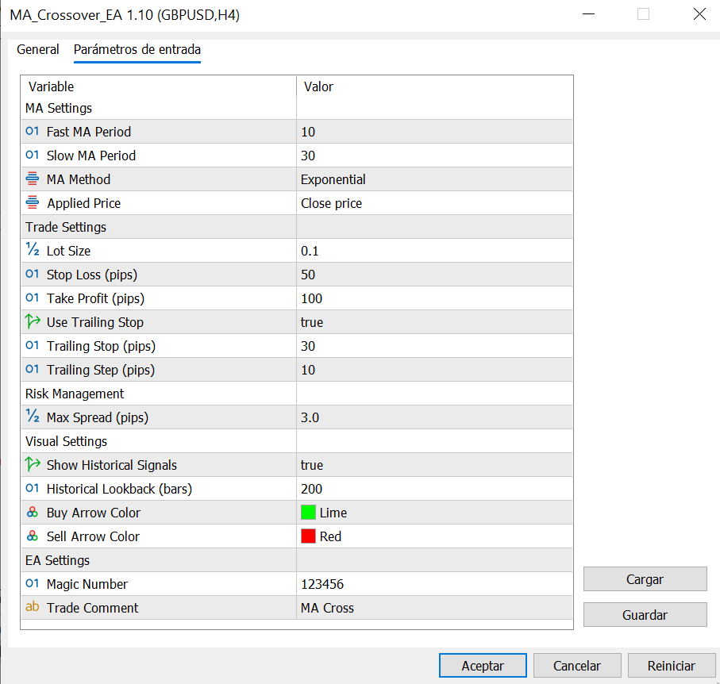
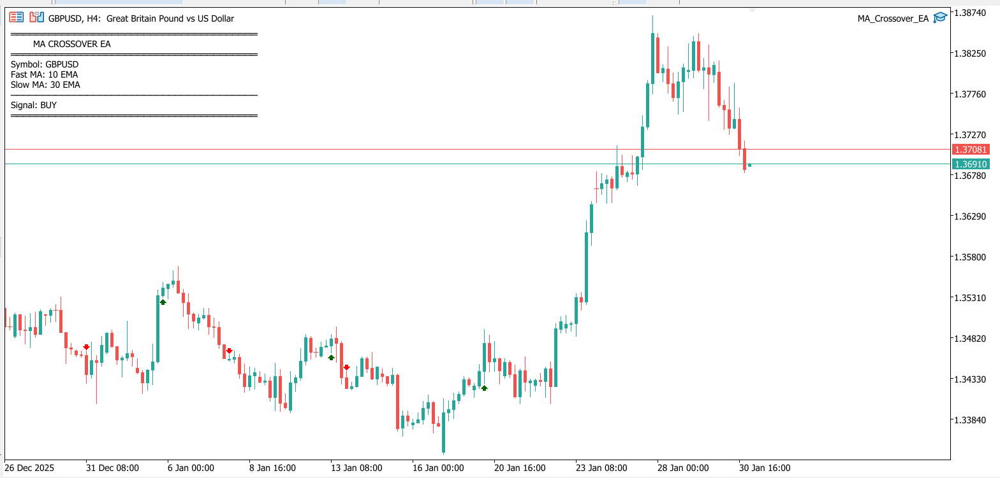

# MA Crossover EA

A robust moving average crossover trading system for MetaTrader 5 featuring automated trade execution, comprehensive risk management, and position tracking.

## Features

- **Automated Trading:** Executes buy/sell orders based on fast and slow MA crossovers
- **Flexible MA Types:** Supports SMA, EMA, SMMA, and LWMA
- **Risk Management:** Built-in stop loss, take profit, and optional trailing stop
- **Position Control:** Magic number system for multi-EA compatibility
- **Spread Filtering:** Avoid trading during high-spread conditions
- **One Trade at a Time:** Prevents multiple simultaneous positions
- **Clean Code:** Uses native MQL5 classes (CTrade, CPositionInfo, CSymbolInfo)

## Strategy Logic

- **Buy Signal:** Fast MA crosses above Slow MA
- **Sell Signal:** Fast MA crosses below Slow MA
- **Entry:** Opens position on the next tick after crossover is confirmed
- **Exit:** Closes via stop loss, take profit, or opposite signal

## Input Parameters

| Parameter | Type | Default | Description |
|-----------|------|---------|-------------|
| Fast_MA_Period | int | 10 | Period for the fast moving average |
| Slow_MA_Period | int | 30 | Period for the slow moving average |
| MA_Method | ENUM_MA_METHOD | MODE_EMA | MA calculation method (SMA/EMA/SMMA/LWMA) |
| Applied_Price | ENUM_APPLIED_PRICE | PRICE_CLOSE | Price to apply MA calculation |
| Lot_Size | double | 0.1 | Fixed lot size per trade |
| Stop_Loss_Pips | int | 50 | Stop loss in pips (0 = disabled) |
| Take_Profit_Pips | int | 100 | Take profit in pips (0 = disabled) |
| Use_Trailing_Stop | bool | true | Enable trailing stop |
| Trailing_Stop_Pips | int | 30 | Trailing stop distance in pips |
| Trailing_Step_Pips | int | 10 | Minimum price movement to adjust trailing stop |
| Max_Spread_Pips | double | 3.0 | Maximum allowed spread in pips |
| Magic_Number | int | 123456 | Unique identifier for this EA's trades |
| Trade_Comment | string | "MA Cross" | Comment for opened trades |

## Installation

1. Copy `MA_Crossover_EA.mq5` to your MetaTrader 5 `MQL5/Experts/` directory
2. Open MetaEditor (F4 in MT5)
3. Open the file and compile it (F7)
4. Restart MT5 or refresh the Navigator panel
5. Find "MA_Crossover_EA" under Expert Advisors
6. Drag it onto your chart

## Usage

1. **Attach to Chart:** Drag the EA onto any currency pair chart
2. **Configure Parameters:** 
   - Adjust MA periods based on your timeframe and strategy
   - Set appropriate lot size for your account balance
   - Configure SL/TP based on pair volatility
3. **Enable Auto-Trading:** Click the "AutoTrading" button in MT5 toolbar
4. **Monitor:** Check the Experts log and Terminal for trade activity

### Risk Management

- Start with small lot sizes (0.01 - 0.1) when testing live
- Use stop loss to limit downside risk
- Consider using a max spread filter to avoid slippage during news events
- Test thoroughly in Strategy Tester before live deployment

## Backtesting Tips

1. **Data Quality:** Use tick data for most accurate results
2. **Optimization:**
   - Optimize Fast and Slow MA periods together
   - Test different MA methods for your instrument
   - Find optimal SL/TP ratios
3. **Timeframes:** Test on M15, H1, and H4 for different trading styles
4. **Walk Forward:** Use walk-forward analysis to validate robustness
5. **Spread:** Set realistic spread values in tester settings

### Recommended Starting Points

- **Scalping (M5-M15):** Fast=5, Slow=15, SL=20, TP=40
- **Day Trading (H1):** Fast=10, Slow=30, SL=50, TP=100
- **Swing Trading (H4):** Fast=20, Slow=50, SL=100, TP=200

## Customization Ideas

- Add additional confirmation filters (RSI, MACD, volume)
- Implement dynamic lot sizing based on account equity
- Add time-based filters (avoid trading during low liquidity hours)
- Implement break-even stop after certain profit level
- Add partial profit taking functionality

## Known Limitations

- Performs poorly in ranging/choppy markets
- Best suited for trending markets
- Crossover signals can lag during rapid price movements
- Consider combining with trend filters for better results

## License

MIT License - See [LICENSE](../LICENSE) for details.

## Author

**Jaume Sancho**  
GitHub: [@jimmer89](https://github.com/jimmer89)

---

*Trading involves risk. Past performance does not guarantee future results. Always use proper risk management.*
