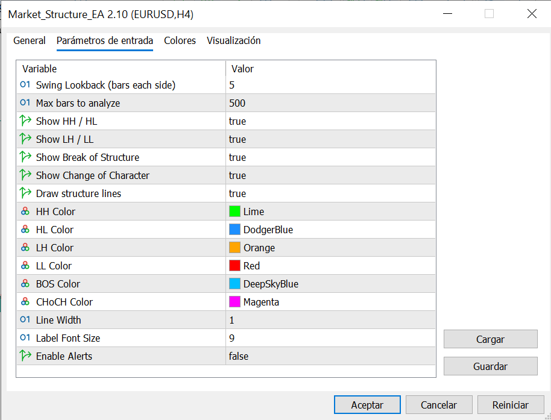
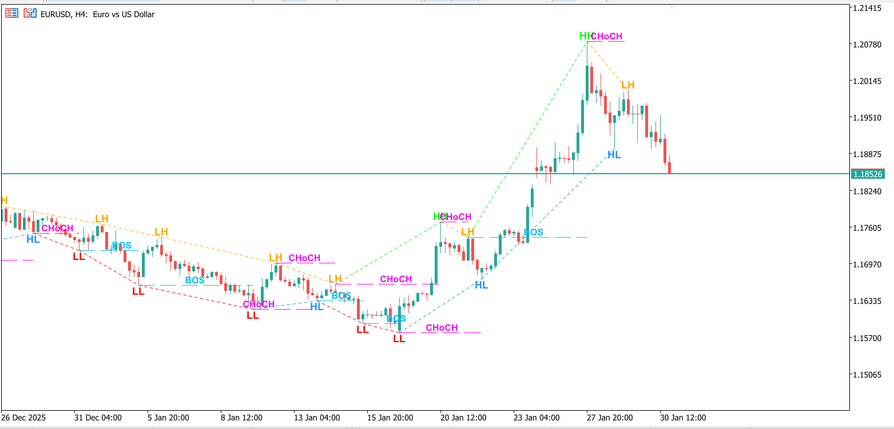

# Market Structure Indicator

An advanced technical indicator for MetaTrader 5 that automatically identifies and visualizes market structure patterns including swing points, higher highs/lows, lower highs/lows, Break of Structure (BOS), and Change of Character (CHoCH).

## Features

- **Swing Point Detection:** Automatically identifies swing highs and swing lows based on configurable lookback
- **Structure Pattern Recognition:** Detects HH (Higher High), HL (Higher Low), LH (Lower High), LL (Lower Low)
- **BOS Detection:** Identifies Break of Structure - when price breaks the previous structure
- **CHoCH Detection:** Identifies Change of Character - potential trend reversal signals
- **Visual Mapping:** Draws lines and labels directly on the chart for easy analysis
- **Optional Alerts:** Configurable alerts for structure changes
- **Non-Trading Tool:** Pure analysis indicator - no automated trading
- **Clean Visuals:** Color-coded labels and lines for quick pattern recognition

## What is Market Structure?

Market structure analysis is a key concept in price action trading:

- **Swing High:** A peak surrounded by lower highs on both sides
- **Swing Low:** A trough surrounded by higher lows on both sides
- **HH (Higher High):** A swing high higher than the previous swing high (bullish)
- **HL (Higher Low):** A swing low higher than the previous swing low (bullish)
- **LH (Lower High):** A swing high lower than the previous swing high (bearish)
- **LL (Lower Low):** A swing low lower than the previous swing low (bearish)
- **BOS:** Price breaks through the most recent opposite swing point
- **CHoCH:** A break that signals potential trend change

## Input Parameters

| Parameter | Type | Default | Description |
|-----------|------|---------|-------------|
| Swing_Lookback | int | 5 | Bars to left/right for swing detection |
| Show_HH_HL | bool | true | Display Higher Highs and Higher Lows |
| Show_LH_LL | bool | true | Display Lower Highs and Lower Lows |
| Show_BOS | bool | true | Show Break of Structure markers |
| Show_CHoCH | bool | true | Show Change of Character markers |
| Draw_Structure_Lines | bool | true | Draw lines connecting swing points |
| HH_Color | color | clrLime | Color for Higher High labels |
| HL_Color | color | clrGreen | Color for Higher Low labels |
| LH_Color | color | clrOrange | Color for Lower High labels |
| LL_Color | color | clrRed | Color for Lower Low labels |
| BOS_Color | color | clrBlue | Color for BOS markers |
| CHoCH_Color | color | clrMagenta | Color for CHoCH markers |
| Line_Width | int | 1 | Width of structure lines |
| Label_Font_Size | int | 8 | Font size for labels |
| Enable_Alerts | bool | false | Enable alerts on structure changes |
| Alert_on_BOS | bool | true | Alert when BOS occurs |
| Alert_on_CHoCH | bool | true | Alert when CHoCH occurs |

## Installation

1. Copy `Market_Structure_EA.mq5` to your MetaTrader 5 `MQL5/Indicators/` directory
2. Open MetaEditor (F4 in MT5)
3. Open the file and compile it (F7)
4. Restart MT5 or refresh the Navigator panel
5. Find "Market_Structure_EA" under Custom Indicators
6. Drag it onto your chart

## Usage

1. **Attach to Chart:** Drag the indicator from Navigator onto any chart
2. **Configure Parameters:** Adjust swing lookback based on your timeframe
   - Smaller lookback (3-5): More sensitive, more swing points
   - Larger lookback (7-10): Less sensitive, major swing points only
3. **Interpret Patterns:**
   - Sequence of HH + HL = Uptrend
   - Sequence of LH + LL = Downtrend
   - BOS = Confirmation of trend continuation
   - CHoCH = Potential trend reversal warning

### Recommended Timeframes

- **Scalping/Day Trading:** M15, H1 with Swing_Lookback = 3-5
- **Swing Trading:** H4, D1 with Swing_Lookback = 5-7
- **Position Trading:** D1, W1 with Swing_Lookback = 7-10

### Trading Applications

This indicator is designed to:
- Identify current market trend direction
- Spot potential reversal points (CHoCH)
- Confirm trend continuation (BOS)
- Find optimal entry/exit zones at swing points
- Combine with support/resistance for higher probability setups

## Analysis Tips

1. **Trend Identification:** Look for consistent HH/HL patterns (uptrend) or LH/LL patterns (downtrend)
2. **Reversal Signals:** Watch for CHoCH after extended trends
3. **Entry Timing:** Consider entries on HL in uptrends, LH in downtrends
4. **Stop Placement:** Place stops below HL (buys) or above LH (sells)
5. **Multi-Timeframe:** Use higher timeframe structure for bias, lower for entries

## Limitations

- Swing points are detected with a delay (requires lookback bars on both sides)
- In choppy/ranging markets, structure patterns may be unclear
- Not a standalone trading system - use with additional confirmation
- Repainting: Swing points finalize only after lookback period completes

## Customization Ideas

- Add Fibonacci retracement levels to swing points
- Integrate order blocks or fair value gaps
- Add liquidity grab detection
- Implement multi-timeframe structure alignment
- Export swing point data for backtesting

## License

MIT License - See [LICENSE](../LICENSE) for details.

## Author

**Jaume Sancho**  
GitHub: [@jimmer89](https://github.com/jimmer89)

---

*This indicator is for educational and analysis purposes. Always practice proper risk management and combine with other forms of analysis.*
