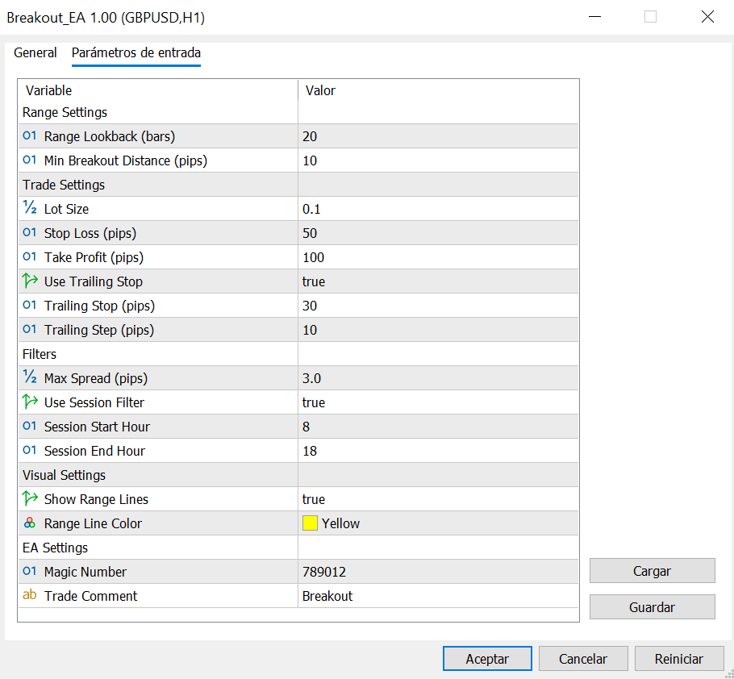
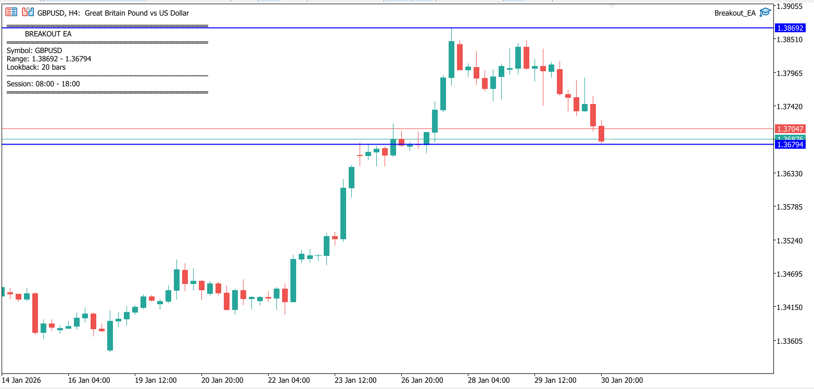

# Breakout EA

A sophisticated range breakout trading system for MetaTrader 5 that identifies consolidation ranges and executes trades when price breaks out, with built-in false breakout filtering and session-based trading controls.

## Features

- **Dynamic Range Detection:** Automatically identifies high/low range based on lookback period
- **Breakout Confirmation:** Requires candle close outside range to avoid false signals
- **Session Filtering:** Trade only during specific market sessions (London/New York)
- **Spread Filter:** Prevents trading during high-spread conditions
- **Minimum Distance Filter:** Ensures breakout has sufficient momentum
- **Trailing Stop:** Locks in profits as price moves favorably
- **Visual Range Display:** Shows current range boundaries on chart
- **One Position at a Time:** Clean position management
- **Configurable Risk:** Adjustable lot size, SL, and TP

## Strategy Logic

1. **Range Definition:** Calculate highest high and lowest low over lookback period
2. **Breakout Detection:** 
   - Bullish breakout: Candle close above range high
   - Bearish breakout: Candle close below range low
3. **Validation:** Check spread, minimum distance, and session filters
4. **Execution:** Open position with predefined SL/TP
5. **Management:** Apply trailing stop to lock in profits

## Input Parameters

| Parameter | Type | Default | Description |
|-----------|------|---------|-------------|
| Range_Lookback_Bars | int | 20 | Bars to calculate range high/low |
| Lot_Size | double | 0.1 | Fixed lot size per trade |
| Stop_Loss_Pips | int | 50 | Stop loss in pips |
| Take_Profit_Pips | int | 100 | Take profit in pips |
| Min_Breakout_Distance_Pips | int | 10 | Minimum breakout distance from range |
| Max_Spread_Pips | double | 3.0 | Maximum allowed spread in pips |
| Use_Session_Filter | bool | true | Enable session-based filtering |
| Session_Start_Hour | int | 8 | Session start hour (broker time) |
| Session_End_Hour | int | 18 | Session end hour (broker time) |
| Use_Trailing_Stop | bool | true | Enable trailing stop |
| Trailing_Stop_Pips | int | 30 | Trailing stop distance in pips |
| Trailing_Step_Pips | int | 10 | Minimum price movement to adjust TS |
| Show_Range_Lines | bool | true | Display range lines on chart |
| Range_Line_Color | color | clrYellow | Color for range boundary lines |
| Magic_Number | int | 789012 | Unique identifier for trades |
| Trade_Comment | string | "Breakout" | Comment for opened trades |

## Installation

1. Copy `Breakout_EA.mq5` to your MetaTrader 5 `MQL5/Experts/` directory
2. Open MetaEditor (F4 in MT5)
3. Open the file and compile it (F7)
4. Restart MT5 or refresh the Navigator panel
5. Find "Breakout_EA" under Expert Advisors
6. Drag it onto your chart

## Usage

1. **Attach to Chart:** Drag EA onto any currency pair chart
2. **Configure Range Period:** 
   - Smaller lookback (10-20): More frequent, smaller ranges
   - Larger lookback (30-50): Less frequent, larger ranges
3. **Set Session Times:** Adjust to match high-volume trading sessions
   - London: 8:00-17:00 GMT
   - New York: 13:00-22:00 GMT
   - Asian: 0:00-9:00 GMT
4. **Configure Risk:** Set appropriate lot size and SL/TP for your account
5. **Enable AutoTrading:** Click the AutoTrading button in MT5
6. **Monitor:** Watch for range formation and breakout execution

### Best Practices

- **Use on volatile pairs:** EUR/USD, GBP/USD, USD/JPY work well
- **Match timeframe to style:** M15-H1 for day trading, H4 for swing trading
- **Avoid ranging markets:** This EA performs best in trending conditions
- **Session alignment:** Trade during overlap sessions (London + New York) for best results
- **Monitor economic calendar:** Pause during major news events

## Backtesting Tips

1. **Data Quality:** Use quality tick data for accurate spread simulation
2. **Timeframe Testing:**
   - M15: Range_Lookback = 20-30, quick scalping style
   - H1: Range_Lookback = 20-40, intraday breakouts
   - H4: Range_Lookback = 15-25, swing breakouts
3. **Optimization:**
   - Optimize Range_Lookback_Bars first
   - Then optimize Min_Breakout_Distance
   - Finally tune SL/TP ratios
4. **Walk-Forward Analysis:** Validate with out-of-sample testing
5. **Session Testing:** Test with and without session filters

### Recommended Settings

**EUR/USD M15 (London Session):**
- Range_Lookback: 24
- Min_Breakout_Distance: 8
- SL: 40, TP: 80
- Session: 8:00-17:00

**GBP/USD H1 (NY Session):**
- Range_Lookback: 20
- Min_Breakout_Distance: 15
- SL: 60, TP: 120
- Session: 13:00-22:00

## Visual Indicators

When `Show_Range_Lines` is enabled, you'll see:
- **Yellow horizontal lines:** Current range high and low
- **Lines update:** As new bars form and range recalculates
- **Clear visual:** Easy to spot when breakout is forming

## Limitations

- **Ranging markets:** Performs poorly in choppy, sideways markets
- **Whipsaws:** Can get false breakouts during low volatility
- **Slippage:** Fast markets may experience slippage on entry
- **Gaps:** Weekend gaps can trigger unexpected trades

## Enhancement Ideas

- Add volatility filter (ATR-based)
- Implement partial profit taking
- Add re-entry logic after stopped out
- Combine with volume analysis
- Add correlation filters for pairs
- Implement dynamic lot sizing based on volatility

## License

MIT License - See [LICENSE](../LICENSE) for details.

## Author

**Jaume Sancho**  
GitHub: [@jimmer89](https://github.com/jimmer89)

---

*Breakout trading carries risk. Always test thoroughly and use proper risk management. Past performance does not guarantee future results.*
